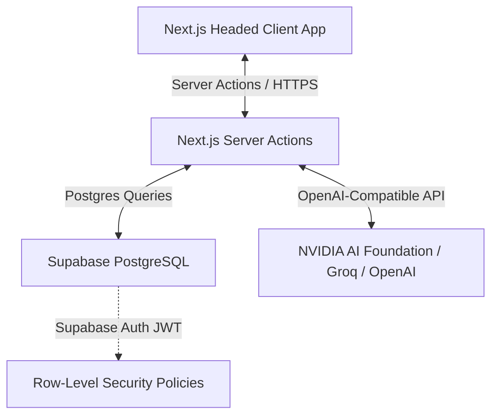
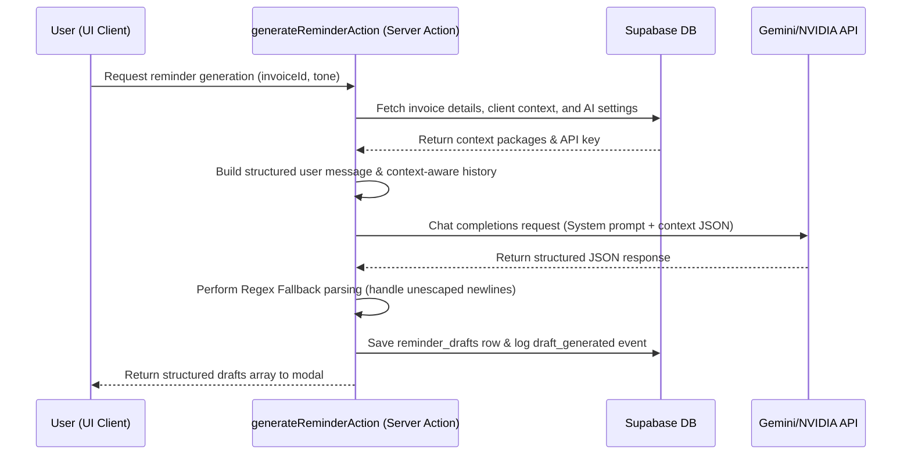

# ChaseFree AI Cloud & Database Infrastructure ☁️💾

This document details the cloud deployment, database schema, security model, and AI integration architecture of **ChaseFree AI**. It serves as the primary technical reference for managing production database states, security policies, and third-party AI provider routing.

---

## 🏗️ 1. System Architecture Overview

ChaseFree AI is built on a highly efficient, serverless, and secure architecture designed for solo freelancers and small agencies:



- **Frontend / Hosting**: Next.js App Router deployed on a serverless Edge environment (e.g., Vercel) for rapid page loads and high responsiveness.
- **Backend / Database**: Supabase PostgreSQL with strict **Row-Level Security (RLS)** active on all tables.
- **State & Action Layer**: React Server Actions for secure, server-side data mutating, separating secrets and API keys from the client-side browser context.
- **AI Inference Layer**: Abstracted provider-agnostic engine routing to OpenAI-compatible endpoints (pre-configured for NVIDIA NIM with `meta/llama-3.1-8b-instruct`).

---

## 📊 2. Database Schema & Tables

The schema is configured using Postgres Enums and relational tables to ensure complete data integrity. All monetary amounts are handled with high-precision `numeric(12,2)`.

### 🗂️ 2.1. Custom Postgres Enums
```sql
-- Represents the strict payment lifecycle of an invoice
create type public.invoice_status as enum (
  'draft',
  'sent',
  'due_soon',
  'overdue',
  'paid',
  'archived'
);

-- Allowed relationship tones for AI draft generation
create type public.reminder_tone as enum (
  'friendly',
  'professional',
  'firm',
  'final_notice'
);

-- Traceable activity types for the chronological history timeline
create type public.reminder_event_type as enum (
  'draft_generated',
  'draft_copied',
  'marked_sent',
  'marked_paid',
  'status_changed',
  'invoice_imported'
);
```

### 📋 2.2. Core Tables

#### 1. `profiles`
Stores app-specific user profile metadata linked to Supabase Auth (`auth.users`).
```sql
create table public.profiles (
  id uuid primary key references auth.users(id) on delete cascade,
  email text not null,
  full_name text,
  avatar_url text,
  default_currency text not null default 'USD',
  created_at timestamptz not null default now(),
  updated_at timestamptz not null default now()
);
```

#### 2. `clients`
Stores customer records for each creative or agency.
```sql
create table public.clients (
  id uuid primary key default gen_random_uuid(),
  user_id uuid not null references auth.users(id) on delete cascade,
  client_name text not null,
  contact_name text,
  email text,
  phone text,
  company_name text,
  notes text,
  created_at timestamptz not null default now(),
  updated_at timestamptz not null default now(),
  constraint clients_client_name_not_blank check (char_length(trim(client_name)) > 0)
);
```

#### 3. `invoices`
Stores individual bills and tracking metadata.
```sql
create table public.invoices (
  id uuid primary key default gen_random_uuid(),
  user_id uuid not null references auth.users(id) on delete cascade,
  client_id uuid not null references public.clients(id) on delete cascade,
  invoice_number text not null,
  title text not null,
  description text,
  issue_date date not null,
  due_date date not null,
  amount numeric(12,2) not null,
  currency text not null default 'USD',
  status public.invoice_status not null default 'sent',
  payment_link text,
  notes text,
  reminder_count integer not null default 0,
  last_reminder_at timestamptz,
  paid_at timestamptz,
  archived_at timestamptz,
  created_at timestamptz not null default now(),
  updated_at timestamptz not null default now(),
  constraint invoices_title_not_blank check (char_length(trim(title)) > 0),
  constraint invoices_invoice_number_not_blank check (char_length(trim(invoice_number)) > 0),
  constraint invoices_amount_non_negative check (amount >= 0),
  constraint invoices_due_date_after_issue_date check (due_date >= issue_date),
  constraint invoices_reminder_count_non_negative check (reminder_count >= 0)
);
```

#### 4. `reminder_drafts`
Stores individual AI-generated follow-up reminder suggestions.
```sql
create table public.reminder_drafts (
  id uuid primary key default gen_random_uuid(),
  user_id uuid not null references auth.users(id) on delete cascade,
  invoice_id uuid not null references public.invoices(id) on delete cascade,
  tone public.reminder_tone not null,
  provider_label text not null,
  model_name text not null,
  subject text not null,
  body text not null,
  short_version text,
  was_copied boolean not null default false,
  was_marked_sent boolean not null default false,
  created_at timestamptz not null default now()
);
```

#### 5. `reminder_events`
Stores activity traces for audit trails and chronological timelines.
```sql
create table public.reminder_events (
  id uuid primary key default gen_random_uuid(),
  user_id uuid not null references auth.users(id) on delete cascade,
  invoice_id uuid not null references public.invoices(id) on delete cascade,
  event_type public.reminder_event_type not null,
  metadata_json jsonb not null default '{}'::jsonb,
  created_at timestamptz not null default now()
);
```

#### 6. `user_ai_settings`
Stores secure LLM configuration per user, preventing client-side API key leakages.
```sql
create table public.user_ai_settings (
  user_id uuid primary key references auth.users(id) on delete cascade,
  provider_label text not null,
  base_url text not null,
  model_name text not null,
  api_key_encrypted text not null,
  temperature numeric(3,2) not null default 0.4,
  is_active boolean not null default true,
  created_at timestamptz not null default now(),
  updated_at timestamptz not null default now(),
  constraint user_ai_settings_temperature_range check (temperature >= 0 and temperature <= 2)
);
```

---

## 🔒 3. Security Boundaries & Row-Level Security (RLS)

ChaseFree AI enforces complete multi-tenant data isolation. A user must **only** be able to see, edit, or delete their own data.

### 🛡️ 3.1. General Rule
All tables are initialized with `enable row level security;`. Requests that fail to present a valid Supabase Auth JWT are immediately blocked.

### 📜 3.2. Concrete RLS Policies

```sql
-- Enforce Profiles Isolation
create policy "profiles_select_own" on public.profiles for select to authenticated using ((select auth.uid()) = id);
create policy "profiles_insert_own" on public.profiles for insert to authenticated with check ((select auth.uid()) = id);
create policy "profiles_update_own" on public.profiles for update to authenticated using ((select auth.uid()) = id) with check ((select auth.uid()) = id);

-- Enforce Client Isolation
create policy "clients_select_own" on public.clients for select to authenticated using ((select auth.uid()) = user_id);
create policy "clients_insert_own" on public.clients for insert to authenticated with check ((select auth.uid()) = user_id);
create policy "clients_update_own" on public.clients for update to authenticated using ((select auth.uid()) = user_id) with check ((select auth.uid()) = user_id);
create policy "clients_delete_own" on public.clients for delete to authenticated using ((select auth.uid()) = user_id);

-- Enforce Invoice Isolation
create policy "invoices_select_own" on public.invoices for select to authenticated using ((select auth.uid()) = user_id);
create policy "invoices_insert_own" on public.invoices for insert to authenticated with check ((select auth.uid()) = user_id);
create policy "invoices_update_own" on public.invoices for update to authenticated using ((select auth.uid()) = user_id) with check ((select auth.uid()) = user_id);
create policy "invoices_delete_own" on public.invoices for delete to authenticated using ((select auth.uid()) = user_id);

-- Enforce AI Configuration and Drafts Isolation
create policy "user_ai_settings_select_own" on public.user_ai_settings for select to authenticated using ((select auth.uid()) = user_id);
create policy "user_ai_settings_insert_own" on public.user_ai_settings for insert to authenticated with check ((select auth.uid()) = user_id);
create policy "user_ai_settings_update_own" on public.user_ai_settings for update to authenticated using ((select auth.uid()) = user_id) with check ((select auth.uid()) = user_id);
```

---

## 🤖 4. AI Provider Integration & Flow

The AI integration layer has been decoupled to support any OpenAI-compatible provider:



### ⚙️ 4.1. Server Action Safeguards
- **Provider-Agnostic Engine**: Uses standard `openai` SDK mapped using the user's custom `base_url` and `api_key_encrypted`.
- **API Key Security**: Decryption and connection are strictly contained inside Next.js Server Actions, meaning no client-side browser has access to or visibility of secret API keys.
- **Robust Parsing Fallback**: When LLMs return raw unescaped newlines inside JSON properties, standard `JSON.parse` crashes. ChaseFree AI uses a specialized regex parser that dynamically isolates and strips malformed JSON string brackets before parsing, preventing runtime UI crashes.

---

## 🚀 5. Performance, Indexing & Scaling

To guarantee rapid loading of the Urgency Dashboard, specialized database indices have been pre-compiled:

```sql
-- Optimize Client search and creation
create index clients_user_id_idx on public.clients(user_id);
create index clients_user_id_created_at_idx on public.clients(user_id, created_at desc);

-- Optimize Overdue and Due Soon queries for "Who to Chase Today"
create index invoices_user_id_idx on public.invoices(user_id);
create index invoices_user_id_status_due_date_idx on public.invoices(user_id, status, due_date);
create index invoices_due_date_idx on public.invoices(due_date);

-- Optimize timeline retrieval and reminder logs
create index reminder_drafts_invoice_id_idx on public.reminder_drafts(invoice_id);
create index reminder_events_invoice_id_idx on public.reminder_events(invoice_id);
create index reminder_events_created_at_idx on public.reminder_events(created_at desc);
```
